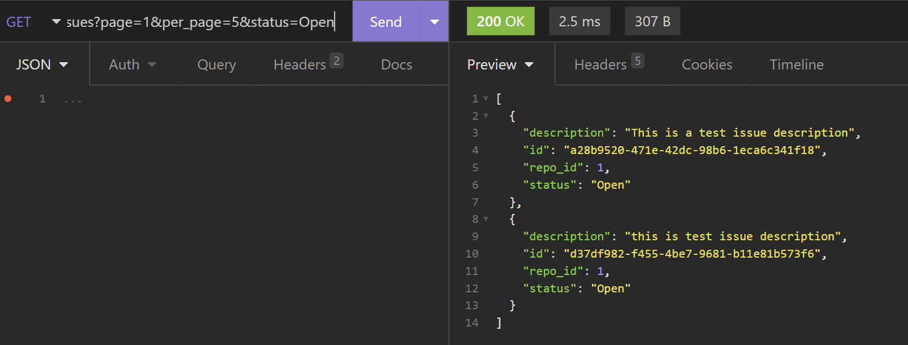
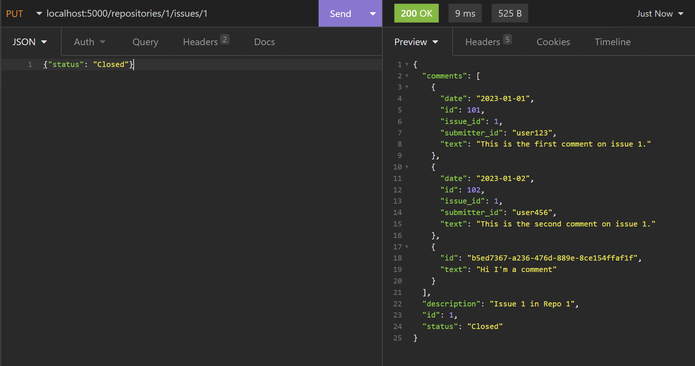

# Tests for Component 1

### Testing "List All Repositories"
-   Endpoint: /repositories (GET)
-   Input: No input required.
-   Expected Output: A list of all repositories.
```
[
	{
		"branches": {
			"dev": [
				"hash456"
			],
			"main": [
				"hash123"
			]
		},
		"id": 1,
		"name": "Repo 1",
		"tags": [
			"v1.0"
		]
	},
	{
		"branches": {
			"main": [
				"hash789"
			]
		},
		"id": 2,
		"name": "Repo 2",
		"tags": [
			"v2.0"
		]
	}
]
```
- Screenshot:

-   Satisfies Requirement: View repositories on Bithub.

### Testing "View Specific Repository"

-    Endpoint: /repositories/\<int:repo_id> (GET)
-   Input: Replace \<int:repo_id> with a valid repository ID, like 1.
-   Expected Output: Details of the specified repository including the latest commit on the main branch.
```
{
	"branches": {
		"main": [
			"hash789"
		]
	},
	"id": 2,
	"latest_commit": {
		"hash": "hash789",
		"message": "Initial commit",
		"repo_id": 2
	},
	"name": "Repo 2",
	"tags": [
		"v2.0"
	]
}
```
- Screenshot:

-   Satisfies Requirement: Default view of the latest commit on the main branch.

### Testing "List Branches in a Repository"
-   Endpoint: /repositories/\<int:repo_id>/branches (GET)
-   Input: Repository ID.
-   Expected Output: List of branches in the specified repository.
```
[
	"main",
	"dev"
]
```
- Screenshot:

-   Satisfies Requirement: Listing all branches.

### Testing "List Tags in a Repository"

-   Endpoint: /repositories/\<int:repo_id>/tags (GET)
-   Input: Repository ID.
-   Expected Output: List of tags in the specified repository.
```
[
	"v2.0"
]
```
- Screenshot:

-   Satisfies Requirement: Listing all tags.

### Testing "List Commits on a Branch"

-   Endpoint: /repositories/\<int:repo_id>/branches/<branch_name>/commits (GET)
-   Input: Repository ID and branch name.
-   Expected Output: Commits on the specified branch.
```
[
	{
		"hash": "hash789",
		"message": "Initial commit",
		"repo_id": 2
	}
]
```
- Screenshot:

-   Satisfies Requirement: Listing commits on a selected branch.

### Testing "View Specific Commit"

-   Endpoint: /repositories/\<int:repo_id>/commits/<commit_hash> (GET)
-   Input: Repository ID and commit hash.
-   Expected Output: Details of the specified commit.
```
{
	"hash": "hash456",
	"message": "Dev commit",
	"repo_id": 1
}
```
- Screenshot:

-   Satisfies Requirement: Rendering an arbitrary commit.

### Testing "View Repository Tree for a Commit"

-   Endpoint: /repositories/\<int:repo_id>/commits/<commit_hash>/tree (GET)
-   Input: Repository ID and commit hash.
-   Expected Output: Repository tree for the specified commit.
```
{
	"/": {
		"items": {
			"dir1": "tree",
			"file1.txt": "blob"
		},
		"type": "tree"
	},
	"dir1/": {
		"items": {
			"file2.txt": "blob",
			"subdir": "tree"
		},
		"type": "tree"
	},
	"dir1/subdir/": {
		"items": {
			"file3.txt": "blob"
		},
		"type": "tree"
	}
}
```
- Screenshot:

-   Satisfies Requirement: Displaying the top-level tree.

### Testing "Retrieve File or Directory Content"

-   Endpoint: /repositories/\<int:repo_id>/tree/<tree_hash>/<path> (GET)
-   Input: Repository ID, tree hash, and file/directory path.
-   Expected Output: File or directory content from a specific commit.
```
{
	"content": [
		"file3.txt"
	],
	"type": "tree"
}
```
- Screenshot:

-   Satisfies Requirement: Retrieval of blobs and sub-trees.


### Testing "List Issues for a Repository"

-   Endpoint: /repositories/\<int:repo_id>/issues (GET)
-   Input: Repository ID.
-   Expected Output: List of issues in the repository.
```
[
	{
		"comments": [
			{
				"date": "2023-01-01",
				"id": 101,
				"issue_id": 1,
				"submitter_id": "user123",
				"text": "This is the first comment on issue 1."
			},
			{
				"date": "2023-01-02",
				"id": 102,
				"issue_id": 1,
				"submitter_id": "user456",
				"text": "This is the second comment on issue 1."
			},
		],
		"description": "Issue 1 in Repo 1",
		"id": 1,
		"status": "Open"
	}
]
```
- Screenshot:

-   Satisfies Requirement: Listing repository issues.


### Testing "Report a New Issue"

-   Endpoint: /repositories/\<int:repo_id>/issues (POST)
-   Input: Repository ID and issue details in JSON format (e.g., {"description": "Issue description"}).
-   Expected Output: Details of the newly created issue.
```
{
	"description": "this is test issue description",
	"id": "d37df982-f455-4be7-9681-b11e81b573f6",
	"repo_id": 1,
	"status": "Open"
}
```
- Screenshot:

-   Satisfies Requirement: Reporting an issue.

### Testing "View a Specific Issue"

-   Endpoint: /repositories/\<int:repo_id>/issues/\<int:issue_id> (GET)
-   Input: Repository ID and issue ID.
-   Expected Output: Details of the specified issue.
```
{
	"comments": [
		{
			"date": "2023-01-01",
			"id": 101,
			"issue_id": 1,
			"submitter_id": "user123",
			"text": "This is the first comment on issue 1."
		},
		{
			"date": "2023-01-02",
			"id": 102,
			"issue_id": 1,
			"submitter_id": "user456",
			"text": "This is the second comment on issue 1."
		},
		{
			"id": "b5ed7367-a236-476d-889e-8ce154ffaf1f",
			"text": "Hi I'm a comment"
		}
	],
	"description": "Issue 1 in Repo 1",
	"id": 1,
	"status": "Closed"
}
```
- Screenshot:

-   Satisfies Requirement: Viewing an issue with details and comments.


### Testing "Submit a New Comment"

-   Endpoint: /repositories/\<int:repo_id>/issues/\<int:issue_id>/comments (POST)
-   Input: Repository ID, issue ID, and comment details in JSON format (e.g., {"text": "Comment text"}).
-   Expected Output: Details of the newly added comment.
```
{
	"id": "601e9b94-5e33-46c2-a0d1-1ca4352ae51f",
	"text": "Hi I'm a comment"
}
```
- Screenshot:

-   Satisfies Requirement: Submitting new comments.

### Testing Pagination and Filtering

-   Endpoint: /repositories/\<int:repo_id>/issues (GET)
-   Input: Repository ID with query parameters for pagination (e.g., page and per_page) and filtering (e.g., status).

localhost:5000/repositories/1/issues?page=1&per_page=5&status=Open
-   Expected Output: A paginated and filtered list of issues.
```
[
	{
		"description": "This is a test issue description",
		"id": "a28b9520-471e-42dc-98b6-1eca6c341f18",
		"repo_id": 1,
		"status": "Open"
	},
	{
		"description": "this is test issue description",
		"id": "d37df982-f455-4be7-9681-b11e81b573f6",
		"repo_id": 1,
		"status": "Open"
	}
]
```
- Screenshot:

-   Satisfies Requirement: Efficient browsing and specific viewing of issues with pagination and filtering

### Testing Update Issue Status

-   Endpoint: /repositories/\<int:repo_id>/issues/\<int:issue_id> (PUT)
-   Input: Repository ID, issue ID, and new status in JSON format (e.g., {"status": "Closed"}).
-   Expected Output: Updated issue with new status.
```
{
	"comments": [
		{
			"date": "2023-01-01",
			"id": 101,
			"issue_id": 1,
			"submitter_id": "user123",
			"text": "This is the first comment on issue 1."
		},
		{
			"date": "2023-01-02",
			"id": 102,
			"issue_id": 1,
			"submitter_id": "user456",
			"text": "This is the second comment on issue 1."
		},
		{
			"id": "b5ed7367-a236-476d-889e-8ce154ffaf1f",
			"text": "Hi I'm a comment"
		},
		{
			"id": "601e9b94-5e33-46c2-a0d1-1ca4352ae51f",
			"text": "Hi I'm a comment"
		}
	],
	"description": "Issue 1 in Repo 1",
	"id": 1,
	"status": "Closed"
}
```
- Screenshot:

-   Satisfies Requirement: Ability to update issue statuses.
